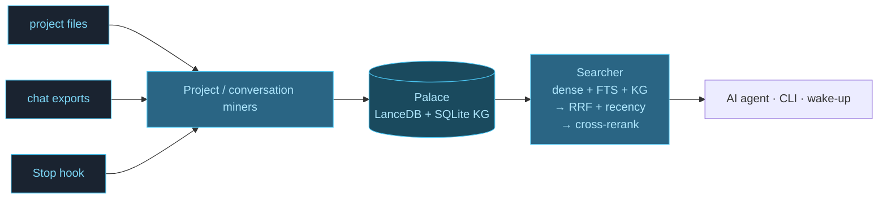

<div align="center">

# Cognitive Castle

<svg viewBox="0 0 320 200" xmlns="http://www.w3.org/2000/svg" width="640" style="max-width:640px;height:auto;" role="img" aria-label="Cognitive Castle architecture: three wings (code, convos, papers) with rooms and drawers, connected by tunnels">
  <defs>
    <pattern id="grid" width="14" height="14" patternUnits="userSpaceOnUse">
      <path d="M 14 0 L 0 0 0 14" fill="none" stroke="#1a2330" stroke-width="0.5"/>
    </pattern>
  </defs>
  <rect width="320" height="200" fill="url(#grid)"/>
  <!-- wing_code -->
  <rect x="20" y="50" width="60" height="130" fill="none" stroke="#4dc9f6" stroke-width="1.5"/>
  <text x="50" y="42" text-anchor="middle" fill="#4dc9f6" font-size="10" font-family="monospace" font-weight="bold">code</text>
  <!-- rooms inside code -->
  <rect x="26" y="58" width="48" height="18" fill="#4dc9f6" opacity="0.15" stroke="#7dd8f8" stroke-width="0.7"/>
  <text x="50" y="70" text-anchor="middle" fill="#7dd8f8" font-size="7" font-family="monospace">backends</text>
  <rect x="26" y="80" width="48" height="18" fill="#4dc9f6" opacity="0.15" stroke="#7dd8f8" stroke-width="0.7"/>
  <text x="50" y="92" text-anchor="middle" fill="#7dd8f8" font-size="7" font-family="monospace">retrieval</text>
  <rect x="26" y="102" width="48" height="18" fill="#4dc9f6" opacity="0.15" stroke="#7dd8f8" stroke-width="0.7"/>
  <text x="50" y="114" text-anchor="middle" fill="#7dd8f8" font-size="7" font-family="monospace">hooks</text>
  <!-- drawer grid for code -->
  <rect x="29" y="128" width="6" height="4" fill="#b0e8ff"/>
  <rect x="37" y="128" width="6" height="4" fill="#b0e8ff"/>
  <rect x="45" y="128" width="6" height="4" fill="#b0e8ff"/>
  <rect x="53" y="128" width="6" height="4" fill="#b0e8ff"/>
  <rect x="61" y="128" width="6" height="4" fill="#b0e8ff"/>
  <rect x="29" y="136" width="6" height="4" fill="#b0e8ff"/>
  <rect x="37" y="136" width="6" height="4" fill="#b0e8ff"/>
  <rect x="45" y="136" width="6" height="4" fill="#b0e8ff"/>
  <rect x="53" y="136" width="6" height="4" fill="#b0e8ff"/>
  <rect x="29" y="144" width="6" height="4" fill="#b0e8ff"/>
  <rect x="37" y="144" width="6" height="4" fill="#b0e8ff"/>
  <text x="50" y="170" text-anchor="middle" fill="#7dd8f8" font-size="6.5" font-family="monospace" opacity="0.7">847 drawers</text>

  <!-- wing_convos -->
  <rect x="130" y="50" width="60" height="130" fill="none" stroke="#4dc9f6" stroke-width="1.5"/>
  <text x="160" y="42" text-anchor="middle" fill="#4dc9f6" font-size="10" font-family="monospace" font-weight="bold">convos</text>
  <rect x="136" y="58" width="48" height="18" fill="#4dc9f6" opacity="0.15" stroke="#7dd8f8" stroke-width="0.7"/>
  <text x="160" y="70" text-anchor="middle" fill="#7dd8f8" font-size="7" font-family="monospace">arch-debate</text>
  <rect x="136" y="80" width="48" height="18" fill="#4dc9f6" opacity="0.15" stroke="#7dd8f8" stroke-width="0.7"/>
  <text x="160" y="92" text-anchor="middle" fill="#7dd8f8" font-size="7" font-family="monospace">bug-hunts</text>
  <rect x="136" y="102" width="48" height="18" fill="#4dc9f6" opacity="0.15" stroke="#7dd8f8" stroke-width="0.7"/>
  <text x="160" y="114" text-anchor="middle" fill="#7dd8f8" font-size="7" font-family="monospace">pairing</text>
  <!-- drawers for convos (more, since count is higher) -->
  <rect x="139" y="128" width="6" height="4" fill="#b0e8ff"/>
  <rect x="147" y="128" width="6" height="4" fill="#b0e8ff"/>
  <rect x="155" y="128" width="6" height="4" fill="#b0e8ff"/>
  <rect x="163" y="128" width="6" height="4" fill="#b0e8ff"/>
  <rect x="171" y="128" width="6" height="4" fill="#b0e8ff"/>
  <rect x="139" y="136" width="6" height="4" fill="#b0e8ff"/>
  <rect x="147" y="136" width="6" height="4" fill="#b0e8ff"/>
  <rect x="155" y="136" width="6" height="4" fill="#b0e8ff"/>
  <rect x="163" y="136" width="6" height="4" fill="#b0e8ff"/>
  <rect x="171" y="136" width="6" height="4" fill="#b0e8ff"/>
  <rect x="179" y="136" width="6" height="4" fill="#b0e8ff"/>
  <rect x="139" y="144" width="6" height="4" fill="#b0e8ff"/>
  <rect x="147" y="144" width="6" height="4" fill="#b0e8ff"/>
  <rect x="155" y="144" width="6" height="4" fill="#b0e8ff"/>
  <rect x="163" y="144" width="6" height="4" fill="#b0e8ff"/>
  <text x="160" y="170" text-anchor="middle" fill="#7dd8f8" font-size="6.5" font-family="monospace" opacity="0.7">2,143 drawers</text>

  <!-- wing_papers -->
  <rect x="240" y="50" width="60" height="130" fill="none" stroke="#4dc9f6" stroke-width="1.5"/>
  <text x="270" y="42" text-anchor="middle" fill="#4dc9f6" font-size="10" font-family="monospace" font-weight="bold">papers</text>
  <rect x="246" y="58" width="48" height="18" fill="#4dc9f6" opacity="0.15" stroke="#7dd8f8" stroke-width="0.7"/>
  <text x="270" y="70" text-anchor="middle" fill="#7dd8f8" font-size="7" font-family="monospace">longmemeval</text>
  <rect x="246" y="80" width="48" height="18" fill="#4dc9f6" opacity="0.15" stroke="#7dd8f8" stroke-width="0.7"/>
  <text x="270" y="92" text-anchor="middle" fill="#7dd8f8" font-size="7" font-family="monospace">agent-mem</text>
  <rect x="246" y="102" width="48" height="18" fill="#4dc9f6" opacity="0.15" stroke="#7dd8f8" stroke-width="0.7"/>
  <text x="270" y="114" text-anchor="middle" fill="#7dd8f8" font-size="7" font-family="monospace">rag-eval</text>
  <!-- drawers for papers (fewer, since count is lower) -->
  <rect x="249" y="128" width="6" height="4" fill="#b0e8ff"/>
  <rect x="257" y="128" width="6" height="4" fill="#b0e8ff"/>
  <rect x="265" y="128" width="6" height="4" fill="#b0e8ff"/>
  <rect x="273" y="128" width="6" height="4" fill="#b0e8ff"/>
  <rect x="281" y="128" width="6" height="4" fill="#b0e8ff"/>
  <rect x="249" y="136" width="6" height="4" fill="#b0e8ff"/>
  <rect x="257" y="136" width="6" height="4" fill="#b0e8ff"/>
  <text x="270" y="170" text-anchor="middle" fill="#7dd8f8" font-size="6.5" font-family="monospace" opacity="0.7">412 drawers</text>

  <!-- tunnel 1: code/retrieval ↔ papers/longmemeval -->
  <path d="M 80 92 Q 160 18 240 67" fill="none" stroke="#b0e8ff" stroke-width="1.2" stroke-dasharray="3 2" opacity="0.7"/>
  <text x="160" y="14" text-anchor="middle" fill="#b0e8ff" font-size="6.5" font-family="monospace" opacity="0.7">"3-stage pipeline" ← driven by longmemeval recall study</text>

  <!-- tunnel 2: convos/bug-hunts ↔ code/hooks -->
  <path d="M 130 92 Q 105 142 80 112" fill="none" stroke="#b0e8ff" stroke-width="1.2" stroke-dasharray="3 2" opacity="0.7"/>
  <text x="105" y="200" text-anchor="middle" fill="#b0e8ff" font-size="6.5" font-family="monospace" opacity="0.7">"-m cognitive-castle bug" ← Stop hook fix</text>
</svg>

**Local-first persistent memory for AI agents.** Verbatim. No API key. 96.6% R@5 on LongMemEval.

[![][version-shield]][release-link]
[![][python-shield]][python-link]
[![][license-shield]][license-link]

</div>

---

## The 30-second pitch

Your AI forgets between sessions. Cognitive Castle stores imported conversations and project files verbatim, organises them by entity (wings → rooms → drawers), and returns their original text. Core storage and retrieval run locally without an external API key. Optional LLM processing uses the provider you explicitly configure; choosing an external provider sends that operation’s input to it. Original drawers are never replaced by summaries.

📦 **Verbatim** · 🔒 **Local by default** · 🔌 **MCP-native** · 🆓 **No API key required for core memory**

The illustration above uses example wings and drawer counts. It is not a live dashboard or the research benchmark dataset.

---

## 💡 Inspired by MemPalace

Cognitive Castle is a fork and continuation of
[**MemPalace**](https://github.com/MemPalace/mempalace) by
**Milla Jovovich**. Every foundational idea — verbatim-only storage, the
AAAK compressed dialect, the wings/rooms/drawers/halls/tunnels palace
architecture, the temporal knowledge graph, the local-first / zero-external-
API principle, and the `PALACE_PROTOCOL` behavioural contract — originates
upstream.

Castle is the integration and distribution layer on top of that design:
LanceDB backend, 3-stage retrieval pipeline, SOAR symbolic re-ranking,
Claude Code plugin, MCP `initialize.instructions` injection, `claude-cli`
provider, and a deterministic text-quality re-rank powered by the vendored
[`understanding`](https://github.com/Testimonial/understanding) package.

Full attribution and per-component credit in
[Acknowledgements](#acknowledgements).

---

## Quickstart

```bash
# 1. Install from source (PyPI package coming soon)
git clone https://github.com/Testimonial/cognitive-castle.git
cd cognitive-castle
pip install -e .

# 2. Build your first palace from a project directory
castle init ~/projects/myapp --yes

# 3. Find something
castle search "why did we switch to graphql"

# 4. Scope to a wing/room
castle search "auth flow" --wing myapp --room backend
```

→ See [How it works](#how-it-works) or [Connect to your MCP client](#connect-to-your-mcp-client)

---

## Retrieval modes

`castle search` starts with Stage 1 (dense, full-text, and knowledge-graph recall) and Stage 2 (fusion and recency). All modes then run Stage 3 (cross-encoder reranking); the table lists Stage 3 and the additional stages selected by each mode:

| Mode | Stages | Use when |
|---|---|---|
| `--mode fast` | Stage 3 (cross-encoder rerank) | Hooks / low-latency wake-up |
| `--mode standard` | Stage 3 + Stage 6 (quality rerank) | Balanced |
| `--mode boosted` | Stage 3 + Stage 5 (SOAR boost-tags) + Stage 6 | With hand-crafted rules |
| `--mode max` (default) | Stage 3 + Stage 4 (LLM judge) + Stage 5 + Stage 6 | Best quality |

### Stage 4 — LLM-as-judge
Uses the LLM configured at `castle init` (Ollama, LM Studio, Anthropic, OpenAI-compat, or `claude-cli` — reuses parent Claude Code auth). Configure via `castle.yaml`:

```yaml
llm_provider: ollama       # or "anthropic" / "openai-compat" / "claude-cli"
llm_model: llama3.1:8b
# llm_endpoint:            # openai-compat / custom Ollama only
# llm_api_key:             # external providers only
```

Or env vars: `CASTLE_LLM_PROVIDER`, `CASTLE_LLM_MODEL`, `CASTLE_LLM_ENDPOINT`, `CASTLE_LLM_API_KEY`, `CASTLE_LLM_TIMEOUT`, `CASTLE_LLM_JUDGE_TOP_N`. The default provider is local Ollama; external providers are optional.

**Failure behavior:** provider errors, timeouts, malformed JSON, and invalid rankings (missing, duplicate, or out-of-range indices) produce a stderr warning and preserve the ordering entering Stage 4. Enabled Stages 5 and 6 still run afterward, so the final ordering may change. The judge validates a complete permutation of candidate indices; it does not use a confidence threshold or certify factual truth. A `JUDGE` audit line appears when search attaches a judge status, not for every identity-order fallback.

### Stage 5 — SOAR symbolic re-ranking
Four hand-crafted productions apply boost-tags with full audit trail. Boosts compound multiplicatively; final boost clamped to `[0.1, 10.0]`.

- `recency-boost`: drawer timestamp is less than 604,800 seconds old → `score × 1.25`. This uses `created_at` (populated from `filed_at` for pipeline rows), not a last-access counter. Exactly seven days is excluded; missing/invalid dates get no recency boost. Offset-aware dates use their UTC offset; naive dates use the host timezone. Future dates are clamped to age zero.
- `same-project`: drawer's wing matches `CASTLE_PROJECT` env → `score × 1.15`
- `entity-match`: the hit carries the knowledge-graph recall provenance flag
- `type-match`: drawer source type aligns with the query intent

Every boosted hit exposes three fields (`score_pre_soar`, `soar_boost`, `soar_tags`) so every score change has a name.

Prerequisites: build Soar 9.6+ with SML Python bindings from [SoarGroup/Soar](https://github.com/SoarGroup/Soar) so `python -c "import Python_sml_ClientInterface"` succeeds. Point `CASTLE_SOAR_RULES_PATH` at your own `.soar` file to extend the production set. Without the SML bindings, Stage 5 emits a warning once per process and returns unchanged scores with neutral SOAR audit fields. A fresh install can therefore search in `max` mode without Soar, but it will not receive symbolic boosts. Use `standard` to skip both the LLM judge and Soar.

### Stage 6 — Deterministic quality rerank
Powered by the vendored [`understanding`](https://github.com/Testimonial/understanding) package: **34 text/specification-quality metrics in five layers**. These are heuristic quality signals informed by requirements-engineering and readability methods, not certification of compliance with a standard or factual truth.

| Layer | Measures | Metrics |
|---|---|---:|
| 1 | Readability, structure, cognitive load | 18 |
| 2 | Semantic category coverage | 6 |
| 3 | Constraint testability | 3 |
| 4 | Behavioral simulatability | 4 |
| 5 | Specification depth | 3 |

The analyzer combines normalized scores into a weighted average. Category weights are structure 15%, readability 10%, cognitive 10%, testability 20%, semantic 15%, behavioral 15%, and depth 15%. Castle applies the configured thresholds to that average: by default, scores ≥0.60 multiply relevance by 1.25, scores ≥0.53 by 1.15, and lower scores by 1.0. Results are sorted by the resulting scores, so a quality boost can move a less relevant candidate ahead of a more relevant one. Missing/malformed analyzer results or per-hit exceptions retain that hit’s original score with neutral audit fields and a warning. See [`quality_rerank.py`](cognitive_castle/quality_rerank.py).

**MCP:** the `castle_search` tool takes the same `mode` parameter — `castle_search(query="...", mode="max")`. The v3.4.0 research shipped a companion tool `castle_info_score(text="...")` that returns a novelty score plus the top-k nearest drawers, callable by AI agents before they file candidate content. It is a separate read-only diagnostic: calling it does not file content or change search ranking. Novelty is not a truth score.

<details>
<summary><b>Migration from MiniLM</b> — click if you built your palace before the 2026-05 embedder cutover</summary>

Palaces built before 2026-05 used `paraphrase-multilingual-MiniLM-L12-v2` (384-dim). The current default is `BAAI/bge-m3` (1024-dim). Castle fails loudly on the next search with a migration prompt rather than a cryptic LanceDB error.

**Option 1 — Migrate to bge-m3 (recommended):**

```bash
castle reindex \
  --palace ~/.castle/palace \
  --sources ~/projects \
  --embedder BAAI/bge-m3 \
  --embedder-dim 1024 \
  --yes
```

**Option 2 — Keep using MiniLM (opt-out):**

```bash
export CASTLE_EMBEDDER_MODEL=sentence-transformers/paraphrase-multilingual-MiniLM-L12-v2
export CASTLE_EMBEDDER_DIM=384
export CASTLE_EMBEDDER_IDENTITY=paraphrase-ml-MiniLM-L12-v2
```

**Known model→dim pairs:**

| `embedder_model` | `embedder_dim` |
|---|---|
| `BAAI/bge-m3` (default) | 1024 |
| `sentence-transformers/paraphrase-multilingual-MiniLM-L12-v2` (legacy) | 384 |
| `BAAI/bge-large-en-v1.5` (English-only) | 1024 |

Changing `embedder_model` / `embedder_dim` in `castle.yaml` without running `castle reindex` triggers a friendly `EmbedderIdentityMismatchError` with the exact reindex command to run — no silent corruption.

**English-only reranker opt-in:** `BAAI/bge-reranker-v2-m3` (default) is multilingual. For English-only corpora, set `CASTLE_RERANKER_MODEL_GPU=mixedbread-ai/mxbai-rerank-large-v2` — outperforms on English MTEB but produces weaker results on non-English content.

</details>

---

## How it works



Three input streams (project files, conversation exports, auto-save hooks) feed the project and conversation miners, which chunk content into verbatim **drawers** and file them into **rooms** (topics) inside **wings** (people or projects). The first three search stages combine dense embeddings, Tantivy full-text and knowledge-graph traversal, fuse candidates with weighted RRF and recency, then apply cross-encoder reranking. The selected retrieval mode adds Stages 4–6 as described above. The retrieved drawers come back as the original text, never a summary.

A **closet pointer** is an entry in the compact AAAK index that refers to the original drawer IDs; it is not a replacement for their verbatim text. Importing a changed file or a growing transcript appends a source revision and preserves previous drawers and closet pointers. Each revision gets its own drawer IDs and index entries, so retrying an interrupted revision does not replace earlier source revisions. A revision is marked complete only after its writes succeed; an interrupted import is retried on the next run. Historical revisions remain searchable, so storage grows with source history. Normalization version 3 preserves short exchanges, whitespace, and code formatting, and disables automatic spelling correction and noise removal during transcript import. Existing sources are re-imported on the next `castle mine` without deleting their earlier records.

---

## Connect to your MCP client

Castle is MCP-native. Claude Code and Codex plugins register the MCP server
and conversation capture hooks. Other MCP clients (Cursor, VS Code + Copilot,
Gemini CLI, any generic MCP consumer) get the same `castle_*` tools — see
[**docs/MCP_CLIENTS.md**](docs/MCP_CLIENTS.md) for one-liner config
per client and a feature-parity matrix.

### Codex

Install the `cognitive-castle` plugin for local MCP memory tools, the `castle`
skill, and background capture of Codex conversations. The plugin lives at this
repository's root; its runtime uses the installed `castle` / `castle-mcp` commands.
Follow [Codex plugin setup](docs/codex-plugin.md) to install the runtime and
plugin, activate **SessionStart / Stop / PreCompact** in `/hooks`, and verify
an actual saved conversation. `/hooks` lists event names; open an event to see
`cognitive-castle` as its source. Installing the plugin alone does not activate
capture.

### Claude Code

Cognitive Castle ships as a Claude Code plugin that auto-registers the MCP server and both auto-save hooks (Stop + PreCompact).

```
# Most users — install from the public marketplace:
/plugin marketplace add Testimonial/cognitive-castle
/plugin install castle@cognitive-castle

# Contributors with a local clone:
/plugin marketplace add /path/to/cognitive-castle
/plugin install castle@cognitive-castle

# then fully quit and reopen Claude Code
```

After reopening, run `/castle:init` once to complete palace setup.

**Manual setup for Claude Code without the plugin:**

```bash
claude mcp add castle -- castle-mcp
```

Restart Claude Code and the `castle_*` tools become available mid-conversation.

**Other MCP clients (Codex, Cursor, VS Code + Copilot, Gemini CLI):**
see [**docs/MCP_CLIENTS.md**](docs/MCP_CLIENTS.md) — one-line config per client, plus a feature-parity matrix.

---

## CLI overview

| Command | Purpose |
|---|---|
| `castle init <dir>` | Detect rooms from folder structure; with `--yes`, also mines |
| `castle mine <dir>` | Mine project files (default mode) |
| `castle mine <dir> --mode convos` | Mine conversation exports (Claude Code, Claude.ai, ChatGPT, Slack) |
| `castle sweep <transcript-dir>` | Per-message catch-up miner (idempotent, resume-safe) |
| `castle search "query"` | Semantic search; filter with `--wing`, `--room`; add --info-weight to demote near-duplicates (opt-in) |
| `castle wake-up` | L0 + L1 wake-up context (~600–900 tokens) |
| `castle status` | Drawer counts per wing/room |
| `castle reindex --palace <path> --sources <dirs>` | Rebuild the palace from source (e.g., after embedder upgrade) |
| `castle mcp` | Print the MCP setup command |
| `castle info-score "text"` | Score how novel a snippet is (v3.4.0 research) |
| `castle prune-suggest --sample N` | Flag low-info drawers for manual review (read-only) |
| `castle share --with codex` | Emit MCP config snippet for Codex / Cursor / VS Code / Gemini CLI (add `--write` to inject) |
| `castle repair --clean-locks` | Remove stale lock files (>24 h) |
| `castle repair --backfill-novelty` | Tag existing drawers with novelty scores (one-time, resumable) |
| `castle repair-status` | Read-only health check |

Full help: `castle --help`, `castle <command> --help`.

Reproducible benchmark numbers (LongMemEval, LoCoMo, ConvoMem, MemBench) and full architecture / palace-structure detail live in [`benchmarks/BENCHMARKS.md`](benchmarks/BENCHMARKS.md) and the `cognitive_castle/` module docstrings. Note: Castle's headline figures are **retrieval recall** (was the right session in the top-K?), not end-to-end QA accuracy — the two are not comparable across systems, and `BENCHMARKS.md` is explicit about which competitors publish which.

---

## Knowledge graph

A temporal entity-relationship graph with validity windows: add, query,
invalidate, timeline. Backed by local SQLite — no extra service to run.

---

## Auto-save hooks

The Claude Code Stop and PreCompact hooks attempt conversation capture:

- **Stop hook** — checks the transcript’s user-message count and attempts a save once at least 15 messages have accumulated since the last save marker. In the default silent mode, the marker advances only after a successful diary save. Ending a shorter session does not force this periodic save.
- **PreCompact hook** — starts transcript ingestion before compaction. Transcript mining runs in a background process; returning from the hook is not confirmation that its writes finished. Project mining, when configured, is synchronous in this handler.

The plugin registers the hooks, but delivery, trust settings, process failures, and successful persistence are separate conditions. These hooks do not guarantee capture before an abrupt process termination or coordinate every overlapping invocation. Retain the source transcripts and verify saved drawers. `castle sweep <transcript-dir>` can catch up from retained Claude-format JSONL transcripts; it is idempotent and resume-safe on its own writes, but does not deduplicate against file-level miner records. For Codex capture and trust settings, see [the Codex guide](docs/codex-plugin.md).

---

## Requirements

- Python 3.9+
- LanceDB (installed automatically)
- Approximately 2.3 GB for the default embedding model weights (`BAAI/bge-m3`); inference needs additional RAM or VRAM depending on device, inputs, and runtime.
- Additional disk space for drawers, indexes, graph data, and retained source revisions. Palace storage grows with imported history; 2.3 GB is not a database size limit.

Core memory means storing original text, building local indexes/embeddings, and retrieving drawers. It needs no external API key. Model weights may require an initial download. Optional LLM operations require a running local model or an explicitly configured external provider.

### Examine requirements stored in Castle with SUE

Select requirement drawers and the interpretation to examine. Castle snapshots
their exact text, runs SUE in the background, and stores a separate dialogue,
questions, understanding profile, and source references inside the palace:

```bash
castle sue review --drawer DRAWER_ID --decision "What exactly does this requirement commit us to?"
castle sue status RUN_ID
```

The default uses local Ollama (`qwen3.5:latest`). For explicitly authorized
external processing, add `--provider codex` (default `gpt-5.6-luna`, low reasoning).
MCP clients use `castle_sue_review` and `castle_sue_status`; restart an existing
Castle MCP connection after upgrading to discover the new tools. All nine SUE
lenses are included. Original drawers stay unchanged. See [SUE scope and
evidence](docs/sue-scope.md) for complete usage and the distinction between
requirement interpretation, factual evidence, and implementation tests.

---

## License

MIT — see [LICENSE](LICENSE).

---

## Research & Mathematics

Castle ships with a research subproject at
[`research/info_theory/`](research/info_theory/) — a first-of-its-kind
information-theoretic study of verbatim personal memory.

**Paper:** *Measuring Information Content in Verbatim AI Memory:
Methodology, Source-Type Heterogeneity, and a Downstream Utility Test*
(preprint in progress —
[`research/info_theory/paper/`](research/info_theory/paper/); arXiv
link will appear here on release).

Three drop-in estimators of drawer information content:

1. **A — `nn_novelty`** — $A(d) = 1 - \max_{d' \in \mathrm{priors}(d)}
   \cos(v_d, v_{d'})$. $O(|\mathrm{priors}|)$ per drawer.
2. **B — `recon_residual`** — Roweis–Saul LLE with Tikhonov
   regularisation: solve $\mathbf{w} = G_{\mathrm{reg}}^{-1} \mathbf{1}
   / (\mathbf{1}^\top G_{\mathrm{reg}}^{-1} \mathbf{1})$ where
   $G_{\mathrm{reg}} = G + \lambda\,\mathrm{tr}(G)\,I$, then
   $B(d) = \|v_d - \mathbf{w}^\top P\|_2$.
3. **C — `llm_surprise`** — LLM-as-judge rates predictability of a
   drawer given 20 same-wing priors on a 1–10 scale; surprise is
   $C(d) = 10 - \mathrm{score}$.

Analysis stack: weighted power-law + exponential fits (AIC-selected),
source-aware block bootstrap for CIs, Kruskal–Wallis with $\varepsilon^2$
for cross-wing heterogeneity, Benjamini–Hochberg FDR at $q = 0.05$.

**First full-palace headline** (65,779 drawers, 7 wings):
$\rho(A, B) = 0.9820$ (95% CI $[0.9817, 0.9823]$, $n = 65{,}746$) — the
$O(1)$ nearest-neighbour score captures $\sim 96\%$ of the variance of
the $O(K^3)$ LLE residual. Exponential decay wins over power-law in all
6 fittable strata ($\Delta \mathrm{AIC} \in [32, 178]$); source-type
heterogeneity is real but modest ($H = 5360$, $p \approx 0$,
$\varepsilon^2 = 0.081$).

Reproducibility manifest:
[`research/info_theory/REPRODUCIBILITY.md`](research/info_theory/REPRODUCIBILITY.md).

---

## Acknowledgements

**Upstream** — [**MemPalace**](https://github.com/MemPalace/mempalace) by
**(https://github.com/milla-jovovich)** — foundational design (see the [Inspired by MemPalace](#-inspired-by-mempalace)
box at the top for the full attribution).

**Castle's integration and distribution layer:**

- LanceDB backend replacing upstream Chroma
- 3-stage retrieval pipeline — dense + Tantivy FTS + knowledge-graph
  traversal, fused via weighted RRF + recency, then cross-encoder reranked
- SOAR symbolic re-ranking productions (Stage 5)
- Claude Code session hooks for background Stop / PreCompact mining
- MCP `initialize.instructions` injection that bakes `PALACE_PROTOCOL` +
  AAAK spec into the client's startup context (PR #48); live palace
  state is queried through tools, not scanned during initialization
- `claude-cli` LLM provider — reuses parent Claude Code's auth for
  Stage 4 judge instead of a separate Messages API key (PR #49)
- Stage 6 deterministic text-quality re-rank powered by the vendored
  [`understanding`](https://github.com/Testimonial/understanding) package
  (v3.7.0, MIT, Ladislav Bihari) — 34 text/specification-quality metrics
  (requirements structure, readability, cognitive load, and substance) on top of
  relevance ranking. Copied in-tree as `cognitive_castle/understanding/`
  so Castle can use the analyzer without depending on the separate Echelon
  project or its transitive dependencies.

Original benchmark methodology and the "wings/rooms/drawers" naming
preserved with credit to the upstream authors.

<!-- Link Definitions -->
[version-shield]: https://img.shields.io/badge/version-3.4.1-4dc9f6?style=flat-square&labelColor=0a0e14
[release-link]: https://github.com/Testimonial/cognitive-castle/releases
[python-shield]: https://img.shields.io/badge/python-3.9+-7dd8f8?style=flat-square&labelColor=0a0e14&logo=python&logoColor=7dd8f8
[python-link]: https://www.python.org/
[license-shield]: https://img.shields.io/badge/license-MIT-b0e8ff?style=flat-square&labelColor=0a0e14
[license-link]: https://github.com/Testimonial/cognitive-castle/blob/develop/LICENSE
