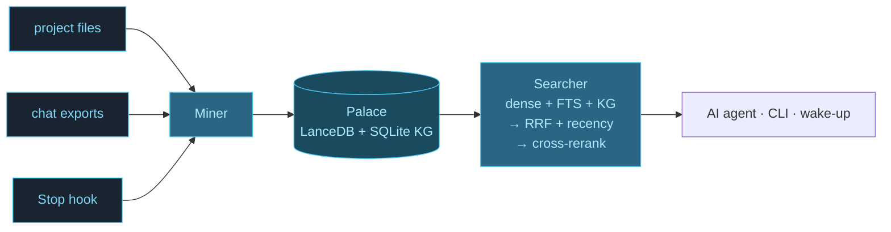
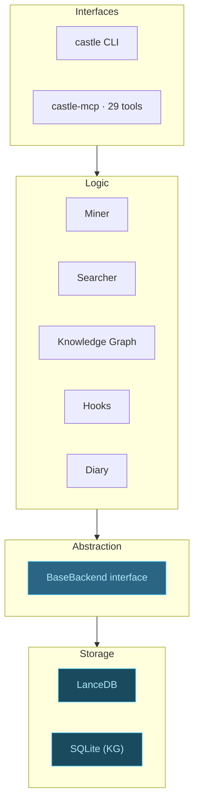

<div align="center">

# Cognitive Castle

<svg viewBox="0 0 320 200" xmlns="http://www.w3.org/2000/svg" width="640" style="max-width:640px;height:auto;" role="img" aria-label="Cognitive Castle architecture: three wings (code, convos, papers) with rooms and drawers, connected by tunnels">
  <defs>
    <pattern id="grid" width="14" height="14" patternUnits="userSpaceOnUse">
      <path d="M 14 0 L 0 0 0 14" fill="none" stroke="#1a2330" stroke-width="0.5"/>
    </pattern>
  </defs>
  <rect width="320" height="200" fill="url(#grid)"/>
  <!-- wing_code -->
  <rect x="20" y="50" width="60" height="130" fill="none" stroke="#4dc9f6" stroke-width="1.5"/>
  <text x="50" y="42" text-anchor="middle" fill="#4dc9f6" font-size="10" font-family="monospace" font-weight="bold">code</text>
  <!-- rooms inside code -->
  <rect x="26" y="58" width="48" height="18" fill="#4dc9f6" opacity="0.15" stroke="#7dd8f8" stroke-width="0.7"/>
  <text x="50" y="70" text-anchor="middle" fill="#7dd8f8" font-size="7" font-family="monospace">backends</text>
  <rect x="26" y="80" width="48" height="18" fill="#4dc9f6" opacity="0.15" stroke="#7dd8f8" stroke-width="0.7"/>
  <text x="50" y="92" text-anchor="middle" fill="#7dd8f8" font-size="7" font-family="monospace">retrieval</text>
  <rect x="26" y="102" width="48" height="18" fill="#4dc9f6" opacity="0.15" stroke="#7dd8f8" stroke-width="0.7"/>
  <text x="50" y="114" text-anchor="middle" fill="#7dd8f8" font-size="7" font-family="monospace">hooks</text>
  <!-- drawer grid for code -->
  <rect x="29" y="128" width="6" height="4" fill="#b0e8ff"/>
  <rect x="37" y="128" width="6" height="4" fill="#b0e8ff"/>
  <rect x="45" y="128" width="6" height="4" fill="#b0e8ff"/>
  <rect x="53" y="128" width="6" height="4" fill="#b0e8ff"/>
  <rect x="61" y="128" width="6" height="4" fill="#b0e8ff"/>
  <rect x="29" y="136" width="6" height="4" fill="#b0e8ff"/>
  <rect x="37" y="136" width="6" height="4" fill="#b0e8ff"/>
  <rect x="45" y="136" width="6" height="4" fill="#b0e8ff"/>
  <rect x="53" y="136" width="6" height="4" fill="#b0e8ff"/>
  <rect x="29" y="144" width="6" height="4" fill="#b0e8ff"/>
  <rect x="37" y="144" width="6" height="4" fill="#b0e8ff"/>
  <text x="50" y="170" text-anchor="middle" fill="#7dd8f8" font-size="6.5" font-family="monospace" opacity="0.7">847 drawers</text>

  <!-- wing_convos -->
  <rect x="130" y="50" width="60" height="130" fill="none" stroke="#4dc9f6" stroke-width="1.5"/>
  <text x="160" y="42" text-anchor="middle" fill="#4dc9f6" font-size="10" font-family="monospace" font-weight="bold">convos</text>
  <rect x="136" y="58" width="48" height="18" fill="#4dc9f6" opacity="0.15" stroke="#7dd8f8" stroke-width="0.7"/>
  <text x="160" y="70" text-anchor="middle" fill="#7dd8f8" font-size="7" font-family="monospace">arch-debate</text>
  <rect x="136" y="80" width="48" height="18" fill="#4dc9f6" opacity="0.15" stroke="#7dd8f8" stroke-width="0.7"/>
  <text x="160" y="92" text-anchor="middle" fill="#7dd8f8" font-size="7" font-family="monospace">bug-hunts</text>
  <rect x="136" y="102" width="48" height="18" fill="#4dc9f6" opacity="0.15" stroke="#7dd8f8" stroke-width="0.7"/>
  <text x="160" y="114" text-anchor="middle" fill="#7dd8f8" font-size="7" font-family="monospace">pairing</text>
  <!-- drawers for convos (more, since count is higher) -->
  <rect x="139" y="128" width="6" height="4" fill="#b0e8ff"/>
  <rect x="147" y="128" width="6" height="4" fill="#b0e8ff"/>
  <rect x="155" y="128" width="6" height="4" fill="#b0e8ff"/>
  <rect x="163" y="128" width="6" height="4" fill="#b0e8ff"/>
  <rect x="171" y="128" width="6" height="4" fill="#b0e8ff"/>
  <rect x="139" y="136" width="6" height="4" fill="#b0e8ff"/>
  <rect x="147" y="136" width="6" height="4" fill="#b0e8ff"/>
  <rect x="155" y="136" width="6" height="4" fill="#b0e8ff"/>
  <rect x="163" y="136" width="6" height="4" fill="#b0e8ff"/>
  <rect x="171" y="136" width="6" height="4" fill="#b0e8ff"/>
  <rect x="179" y="136" width="6" height="4" fill="#b0e8ff"/>
  <rect x="139" y="144" width="6" height="4" fill="#b0e8ff"/>
  <rect x="147" y="144" width="6" height="4" fill="#b0e8ff"/>
  <rect x="155" y="144" width="6" height="4" fill="#b0e8ff"/>
  <rect x="163" y="144" width="6" height="4" fill="#b0e8ff"/>
  <text x="160" y="170" text-anchor="middle" fill="#7dd8f8" font-size="6.5" font-family="monospace" opacity="0.7">2,143 drawers</text>

  <!-- wing_papers -->
  <rect x="240" y="50" width="60" height="130" fill="none" stroke="#4dc9f6" stroke-width="1.5"/>
  <text x="270" y="42" text-anchor="middle" fill="#4dc9f6" font-size="10" font-family="monospace" font-weight="bold">papers</text>
  <rect x="246" y="58" width="48" height="18" fill="#4dc9f6" opacity="0.15" stroke="#7dd8f8" stroke-width="0.7"/>
  <text x="270" y="70" text-anchor="middle" fill="#7dd8f8" font-size="7" font-family="monospace">longmemeval</text>
  <rect x="246" y="80" width="48" height="18" fill="#4dc9f6" opacity="0.15" stroke="#7dd8f8" stroke-width="0.7"/>
  <text x="270" y="92" text-anchor="middle" fill="#7dd8f8" font-size="7" font-family="monospace">agent-mem</text>
  <rect x="246" y="102" width="48" height="18" fill="#4dc9f6" opacity="0.15" stroke="#7dd8f8" stroke-width="0.7"/>
  <text x="270" y="114" text-anchor="middle" fill="#7dd8f8" font-size="7" font-family="monospace">rag-eval</text>
  <!-- drawers for papers (fewer, since count is lower) -->
  <rect x="249" y="128" width="6" height="4" fill="#b0e8ff"/>
  <rect x="257" y="128" width="6" height="4" fill="#b0e8ff"/>
  <rect x="265" y="128" width="6" height="4" fill="#b0e8ff"/>
  <rect x="273" y="128" width="6" height="4" fill="#b0e8ff"/>
  <rect x="281" y="128" width="6" height="4" fill="#b0e8ff"/>
  <rect x="249" y="136" width="6" height="4" fill="#b0e8ff"/>
  <rect x="257" y="136" width="6" height="4" fill="#b0e8ff"/>
  <text x="270" y="170" text-anchor="middle" fill="#7dd8f8" font-size="6.5" font-family="monospace" opacity="0.7">412 drawers</text>

  <!-- tunnel 1: code/retrieval ↔ papers/longmemeval -->
  <path d="M 80 92 Q 160 18 240 67" fill="none" stroke="#b0e8ff" stroke-width="1.2" stroke-dasharray="3 2" opacity="0.7"/>
  <text x="160" y="14" text-anchor="middle" fill="#b0e8ff" font-size="6.5" font-family="monospace" opacity="0.7">"3-stage pipeline" ← driven by longmemeval recall study</text>

  <!-- tunnel 2: convos/bug-hunts ↔ code/hooks -->
  <path d="M 130 92 Q 105 142 80 112" fill="none" stroke="#b0e8ff" stroke-width="1.2" stroke-dasharray="3 2" opacity="0.7"/>
  <text x="105" y="200" text-anchor="middle" fill="#b0e8ff" font-size="6.5" font-family="monospace" opacity="0.7">"-m cognitive-castle bug" ← Stop hook fix</text>
</svg>

**Local-first persistent memory for AI agents.** Verbatim. No API key. 96.6% R@5 on LongMemEval.

[![][version-shield]][release-link]
[![][python-shield]][python-link]
[![][license-shield]][license-link]


</div>

---

## The 30-second pitch

Your AI forgets between sessions. Cognitive Castle stores every conversation and project file verbatim, organises them by entity (wings → rooms → drawers), and gives them back word-for-word in milliseconds. It runs entirely on your laptop — no API keys, no cloud, no summarisation.

📦 **Verbatim** · 🔒 **100% Local** · 🔌 **MCP-native** · 🆓 **No API key**

---

## Quickstart

```bash
# 1. Install
pip install cognitive-castle

# 2. Build your first palace from a project directory
castle init ~/projects/myapp --yes

# 3. Find something
castle search "why did we switch to graphql"

# 4. Scope to a wing/room
castle search "auth flow" --wing myapp --room backend
```


→ See [How it works](#how-it-works) or [Connect to Claude Code](#connect-to-claude-code)

---

## How it works



**See verbatim retrieval in action:**


Three input streams (project files, conversation exports, auto-save hooks) feed a single miner that chunks them into verbatim **drawers** and files them into **rooms** (topics) inside **wings** (people or projects). Search runs a 3-stage pipeline — dense embeddings + Tantivy full-text + knowledge-graph traversal, fused with weighted RRF and recency, then cross-encoder reranked. The retrieved drawers come back as the original text, never a summary.

---

## Connect to Claude Code

Cognitive Castle ships as a Claude Code plugin that auto-registers the MCP server and both auto-save hooks (Stop + PreCompact).

```
# Most users — install from the public marketplace:
/plugin marketplace add Testimonial/cognitive-castle
/plugin install castle@cognitive-castle

# Contributors with a local clone:
/plugin marketplace add /path/to/cognitive-castle
/plugin install castle@cognitive-castle

# then fully quit and reopen Claude Code
```

**What it looks like in a Claude Code session:**


After reopening, run `/castle:init` once to complete palace setup.

**Manual setup for non-Claude-Code MCP clients:**

```bash
claude mcp add castle -- castle-mcp
```

Restart your AI client and the `castle_*` tools become available mid-conversation.

---

## CLI overview

| Command | Purpose |
|---|---|
| `castle init <dir>` | Detect rooms from folder structure; with `--yes`, also mines |
| `castle mine <dir>` | Mine project files (default mode) |
| `castle mine <dir> --mode convos` | Mine conversation exports (Claude Code, Claude.ai, ChatGPT, Slack) |
| `castle sweep <transcript-dir>` | Per-message catch-up miner (idempotent, resume-safe) |
| `castle search "query"` | Semantic search; filter with `--wing`, `--room` |
| `castle wake-up` | L0 + L1 wake-up context (~600–900 tokens) |
| `castle status` | Drawer counts per wing/room |
| `castle reindex --palace <path> --sources <dirs>` | Rebuild the palace from source (e.g., after embedder upgrade) |
| `castle mcp` | Print the MCP setup command |
| `castle repair --clean-locks` | Remove stale lock files (>24 h) |
| `castle repair-status` | Read-only health check |

Full help: `castle --help`, `castle <command> --help`.

---

## Benchmarks

Numbers are reproducible from this repository with the commands in
[`benchmarks/BENCHMARKS.md`](benchmarks/BENCHMARKS.md). Per-question
result files are committed under `benchmarks/results_*`.

**LongMemEval — retrieval recall (R@5, 500 questions):**

| Mode | R@5 | LLM required |
|---|---|---|
| Raw (semantic search, no heuristics, no LLM) | **96.6%** | None |
| Hybrid v4, held-out 450q (tuned on 50 dev) | **98.4%** | None |
| Hybrid v4 + LLM rerank (full 500) | ≥99% | Any capable model |

The raw 96.6% requires no API key, no cloud, and no LLM at any stage.
The hybrid pipeline adds keyword boosting, temporal-proximity boosting,
and preference-pattern extraction; the held-out 98.4% is the honest
generalisable figure.

The rerank pipeline promotes the best candidate out of the top-20
retrieved sessions using an LLM reader. It works with any reasonably
capable model. We do not headline a "100%" number because the last 0.6%
was reached by inspecting specific wrong answers, which
`benchmarks/BENCHMARKS.md` flags as teaching to the test.

**Other benchmarks (full results in [`benchmarks/BENCHMARKS.md`](benchmarks/BENCHMARKS.md)):**

| Benchmark | Metric | Score | Notes |
|---|---|---|---|
| LoCoMo (session, top-10, no rerank) | R@10 | 60.3% | 1,986 questions |
| LoCoMo (hybrid v5, top-10, no rerank) | R@10 | 88.9% | Same set |
| ConvoMem (all categories, 250 items) | Avg recall | 92.9% | 50 per category |
| MemBench (ACL 2025, 8,500 items) | R@5 | 80.3% | All categories |

**Reproducing every result:**

```bash
git clone https://github.com/Testimonial/cognitive-castle.git
cd cognitive-castle
pip install -e ".[dev]"
# see benchmarks/README.md for dataset download commands
python benchmarks/longmemeval_bench.py /path/to/longmemeval_s_cleaned.json
```

---

## Why Castle vs mem0 / letta / zep

mem0, letta, and zep are excellent AI memory systems. Castle is the choice when you specifically need verbatim recall on your laptop with no service running and no API key.

| | Cognitive Castle | mem0 | letta | zep |
|---|---|---|---|---|
| Verbatim storage | ✅ guaranteed | ❌ summarises | ⚠ tiered (verbatim core + summarised archive) | ❌ extracts |
| Local-first default | ✅ | ⚠ optional | ⚠ self-host | ⚠ self-host |
| API key required | ❌ none for core | ⚠ for cloud | depends on LLM | ❌ |
| MCP-native | ✅ plugin | ❌ | ❌ | ❌ |
| Backend | LanceDB (pluggable) | pgvector/Qdrant | varies | pgvector |
| Published benchmarks | ✅ 4 datasets | partial | ⚠ | partial |

mem0 excels at multi-agent shared memory in production cloud deployments. letta is the right choice when you want a full agent runtime, not just a memory layer. zep is excellent if you're already building on PostgreSQL and want chat history with extraction.

---

## Architecture



- **Wings** — top-level groupings (projects, agents, conversations)
- **Rooms** — topical or structural subdivisions auto-detected from folder layout
- **Drawers** — verbatim content chunks; each one is searchable independently
- **Tunnels** — typed cross-references between drawers (graph edges)
- **Diaries** — per-agent append-only logs

---

## Knowledge graph

A temporal entity-relationship graph with validity windows: add, query,
invalidate, timeline. Backed by local SQLite — no extra service to run.

---

## Auto-save hooks

Two Claude Code hooks save context automatically in the background:

- **Stop hook** — fires every ~15 turns, mines the conversation into the palace without interrupting you
- **PreCompact hook** — emergency save triggered before context compaction so nothing is lost

Both hooks are auto-registered when you install the plugin. `castle sweep <transcript-dir>` provides per-message catch-up on top of the file-level chunks the hooks produce — idempotent and resume-safe.

---

## Requirements

- Python 3.9+
- LanceDB (installed automatically)
- ~500 MB disk for the default embedding model (`paraphrase-multilingual-MiniLM-L12-v2`)

No API key is required for the core path.

---

## License

MIT — see [LICENSE](LICENSE).

---

## Acknowledgements

Cognitive Castle is a fork and continuation of the MemPalace project,
re-architected around LanceDB and the SOAR cognitive-architecture
heuristics. Original benchmark methodology and "wings/rooms/drawers"
naming preserved with credit to the upstream authors.

<!-- Link Definitions -->
[version-shield]: https://img.shields.io/badge/version-3.3.3-4dc9f6?style=flat-square&labelColor=0a0e14
[release-link]: https://github.com/Testimonial/cognitive-castle/releases
[python-shield]: https://img.shields.io/badge/python-3.9+-7dd8f8?style=flat-square&labelColor=0a0e14&logo=python&logoColor=7dd8f8
[python-link]: https://www.python.org/
[license-shield]: https://img.shields.io/badge/license-MIT-b0e8ff?style=flat-square&labelColor=0a0e14
[license-link]: https://github.com/Testimonial/cognitive-castle/blob/main/LICENSE
