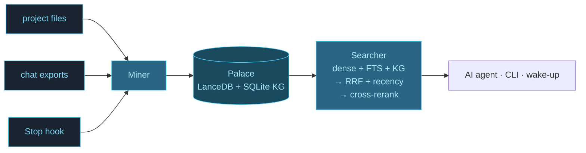
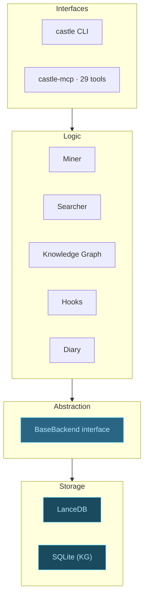

# README Productization v1 — Design

**Date:** 2026-05-12
**Branch target:** develop
**Scope:** PR #1 of the multi-PR productization series. README rewrite + 3 diagrams (1 SVG hero, 2 Mermaid) + stale-content fixes. No production code touched.

## Background

The current README (`README.md`, 208 lines, last touched in PR #6's MemPalace→Cognitive Castle sweep) is technically solid but has gaps that hurt productization:

1. **No hero visual** — ASCII architecture boxes only. First-time visitors get no visual hook to anchor the metaphor (`wings → rooms → drawers → tunnels`) that gives the product its name and conceptual model.
2. **Stale content** from since-shipped PRs:
   - Architecture box says "ChromaDB (legacy)" — PR #8 deleted chroma entirely
   - Requirements says embedding is `all-MiniLM-L6-v2` — production has been `paraphrase-multilingual-MiniLM-L12-v2` since the SOTA cutover (commit `2ee6467a`)
   - CLI overview table has `migrate` (deleted in PR #8) and is missing `reindex` (added in PR #2) and `sweep`
3. **No comparison framing** — readers evaluating against mem0 / letta / zep have to assemble that comparison themselves
4. **MCP install path** doesn't mention the new plugin flow (`/plugin marketplace add` + `/plugin install castle@cognitive-castle`) which is the path most Claude Code users will take
5. **Tone is uniformly technical** — there's no 30-second hook for newcomers before the README gets dense

The user has explicitly asked for "graph chart map how this works" — three diagrams are the centerpiece of this PR.

This is **PR #1 of a 6-piece productization series**:
1. README + diagrams ← *this PR*
2. Demo GIF / screencast
3. Landing page
4. Comparison microsite
5. Launch post drafts (Show HN, X, r/LocalLLaMA)
6. Sample palace download (try-before-mine)

PRs 2-6 are deferred and out of scope here. The hero copy, comparison content, and 30-second pitch produced in this PR get reused downstream by 3-5.

## Goals

1. Readers can decide in <30 seconds whether Castle is for them.
2. The wings/rooms/drawers/tunnels metaphor is visually grounded — first paint shows it.
3. The 4-step quickstart (install / init / search / search-with-filter) is reproducible by a stranger in <5 minutes.
4. Engineers evaluating mem0 / letta / zep can see the differentiator (verbatim + local-first + MCP-native) without reading the full README.
5. Stale content from previous PRs is removed.
6. All three diagrams render natively in GitHub-flavored Markdown (no PNG assets to maintain).
7. README length stays under 320 lines (currently 208).

## Non-goals

- Marketing landing page or microsite (deferred to PR #3)
- Demo GIF / screencast (deferred to PR #2)
- Translation / i18n
- Docs site separation (still single README until it outgrows itself)
- Re-running benchmarks (numbers are reused as-is; if any are stale, surface in a follow-up, do not fix here)
- Production code changes — any code-side stale references found get filed as a separate issue
- Changing the badge palette / color scheme — palette stays `#0a0e14` background, `#4dc9f6 / #7dd8f8 / #b0e8ff` accent gradient (matches existing badges)

## Source of truth

- Current README: `README.md` (208 lines, commit `f08e9762`)
- Current architecture (post-PR #8): `cognitive_castle/backends/__init__.py`, `cognitive_castle/backends/lancedb_backend.py`, `cognitive_castle/searcher.py` (3-stage pipeline)
- Current MCP plugin install path: `.claude-plugin/marketplace.json`, `.claude-plugin/plugin.json`, `.claude-plugin/README.md`
- Embedding model in production: `cognitive_castle/config.py` line ~110 — `embedding_model_name = "sentence-transformers/paraphrase-multilingual-MiniLM-L12-v2"`
- Benchmark numbers: `benchmarks/BENCHMARKS.md` (do NOT modify in this PR)
- Decisions from the brainstorm session (this file's source): all 4 user answers locked
  - Scope: full multi-PR series, ship PR #1 now (`README + diagram`)
  - Audience: layered (newcomer → eval → builder)
  - Format: SVG hero + Mermaid for the other two diagrams
  - Hero example: `code` / `convos` / `papers` wings with `(847 / 2143 / 412)` drawer counts and storied tunnels
  - Hero style: blueprint/schematic (NOT isometric, NOT abstract concentric)

## File-by-file change list

### `README.md` — full rewrite

Replace the entire current file. Final structure (14 sections):

#### 1. Hero (lines ~1-25)

- Centered `<div align="center">` wrapper.
- Title: `# Cognitive Castle`
- **NEW**: inline SVG castle-blueprint diagram (full source in [Hero SVG](#hero-svg-source) below).
- Tagline (1 line, bold): `**Local-first persistent memory for AI agents.** Verbatim. No API key. 96.6% R@5 on LongMemEval.`
- Existing 3-badge row (version / python / license) — keep, position below tagline.

#### 2. The 30-second pitch (lines ~25-45)

New section. 3-4 sentences max. Concrete pain → concrete promise. Draft:

> Your AI forgets between sessions. Cognitive Castle stores every conversation and project file verbatim, organises them by entity (wings → rooms → drawers), and gives them back word-for-word in milliseconds. It runs entirely on your laptop — no API keys, no cloud, no summarisation.

Followed by a 4-chip differentiator row. Render as inline emoji + bold text, separated by ` · ` (interpunct + spaces), on a single line:

```markdown
📦 **Verbatim** · 🔒 **100% Local** · 🔌 **MCP-native** · 🆓 **No API key**
```

Each chip wraps to its own line on narrow screens automatically — no table, no flexbox needed.

#### 3. Quickstart (lines ~45-75)

Replace current 5-step "Quickstart". Keep the spirit but tighten. 4 numbered steps with code blocks:

```bash
# 1. Install
pip install cognitive-castle

# 2. Build your first palace from a project directory
castle init ~/projects/myapp --yes

# 3. Find something
castle search "why did we switch to graphql"

# 4. Scope to a wing/room
castle search "auth flow" --wing myapp --room backend
```

Followed by a 1-line "next-step" pointer: `→ See [How it works](#how-it-works) or [Connect to Claude Code](#connect-to-claude-code)`

#### 4. How it works (lines ~75-110)

NEW section. Lead with the Mermaid data-flow diagram (source in [Data flow Mermaid](#data-flow-mermaid-source) below).

Then 2-3 sentences of prose:

> Three input streams (project files, conversation exports, auto-save hooks) feed a single miner that chunks them into verbatim **drawers** and files them into **rooms** (topics) inside **wings** (people or projects). Search runs a 3-stage pipeline — dense embeddings + Tantivy full-text + knowledge-graph traversal, fused with weighted RRF and recency, then cross-encoder reranked. The retrieved drawers come back as the original text, never a summary.

#### 5. Connect to Claude Code (lines ~110-140)

UPDATED. Lead with plugin install path:

```
# In Claude Code:
/plugin marketplace add Testimonial/cognitive-castle
/plugin install castle@cognitive-castle
# then fully quit and reopen Claude Code
```

Mention that this auto-registers the MCP server + Stop/PreCompact hooks.

Below, keep the manual MCP setup as a fallback for non-Claude-Code clients:

```
claude mcp add castle -- castle-mcp
```

#### 6. CLI overview (lines ~140-165)

UPDATED table. Drop `migrate` (deleted PR #8). Add `reindex` and `sweep`. Update `repair` description (legacy chroma rebuild was removed in PR #8; `repair --clean-locks` is what remains).

| Command | Purpose |
|---|---|
| `castle init <dir>` | Detect rooms from folder structure; with `--yes`, also mines |
| `castle mine <dir>` | Mine project files (default mode) |
| `castle mine <dir> --mode convos` | Mine conversation exports (Claude Code, Claude.ai, ChatGPT, Slack) |
| `castle sweep <transcript-dir>` | Per-message catch-up miner (idempotent, resume-safe) |
| `castle search "query"` | Semantic search; filter with `--wing`, `--room` |
| `castle wake-up` | L0 + L1 wake-up context (~600-900 tokens) |
| `castle status` | Drawer counts per wing/room |
| `castle reindex --sources <dirs>` | Rebuild the palace from source (e.g., after embedder upgrade) |
| `castle mcp` | Print the MCP setup command |
| `castle repair --clean-locks` | Remove stale lock files (>24 h) |
| `castle repair-status` | Read-only health check |

#### 7. Benchmarks (lines ~165-200)

KEEP CURRENT CONTENT — no changes. The 96.6% / 98.4% / 99% LongMemEval numbers and the multi-dataset table are good as-is. Verify the reproducing-commands at the bottom still work as-written.

#### 8. Why Castle vs mem0 / letta / zep (lines ~200-230)

NEW section. Lead with a 1-sentence framing:

> mem0, letta, and zep are excellent AI memory systems. Castle is the choice when you specifically need verbatim recall on your laptop with no service running and no API key.

Then a compact comparison table:

| | Cognitive Castle | mem0 | letta | zep |
|---|---|---|---|---|
| Verbatim storage | ✅ guaranteed | ❌ summarises | ❌ summarises | ❌ summarises |
| Local-first default | ✅ | ⚠ optional | ⚠ self-host | ⚠ self-host |
| API key required | ❌ none for core | ⚠ for cloud | depends on LLM | ❌ |
| MCP-native | ✅ plugin | ❌ | ❌ | ❌ |
| Backend | LanceDB (pluggable) | pgvector/Qdrant | varies | pgvector |
| Published benchmarks | ✅ 4 datasets | partial | ⚠ | partial |

Followed by 1-2 sentences explicitly noting use-cases where the others win (fairness):

> mem0 excels at multi-agent shared memory in production cloud deployments. letta is the right choice when you want a full agent runtime, not just a memory layer. zep is excellent if you're already building on PostgreSQL and want chat history with extraction.

#### 9. Architecture (lines ~230-260)

REPLACE current ASCII box with the Mermaid layered-stack diagram (source in [Layered stack Mermaid](#layered-stack-mermaid-source) below).

Followed by the existing 5-bullet glossary:
- **Wings** — top-level groupings (projects, agents, conversations)
- **Rooms** — topical or structural subdivisions auto-detected from folder layout
- **Drawers** — verbatim content chunks; each one is searchable independently
- **Tunnels** — typed cross-references between drawers (graph edges)
- **Diaries** — per-agent append-only logs

#### 10. Knowledge graph (lines ~260-275)

KEEP as-is. Polish copy slightly.

#### 11. Auto-save hooks (lines ~275-295)

KEEP. Mention Stop hook (every ~15 turns) and PreCompact hook (emergency save). Note that the hooks are auto-registered when the plugin is installed.

#### 12. Requirements (lines ~295-310)

FIX: change `all-MiniLM-L6-v2` → `paraphrase-multilingual-MiniLM-L12-v2`. Also update disk-size estimate (~500 MB for the new model vs ~300 MB previously).

#### 13. License (lines ~310-315)

KEEP.

#### 14. Acknowledgements (lines ~315-320)

KEEP. Verify the SOAR cognitive-architecture mention is still load-bearing; if it's a vestige, trim. (Out of scope for the implementer to research — leave as-is unless trivial to verify in 30s.)

### Link definitions (footer)

Keep existing 6 link definitions. Add no new ones unless any new section refs need them.

## Hero SVG source

Inline `<svg>` block in the README (not a file under `assets/`). 320×200 viewBox. Source verbatim from the brainstorming session's locked v3 blueprint:

```html
<svg viewBox="0 0 320 200" xmlns="http://www.w3.org/2000/svg" style="max-width:640px;height:auto;" role="img" aria-label="Cognitive Castle architecture: three wings (code, convos, papers) with rooms and drawers, connected by tunnels">
  <defs>
    <pattern id="grid" width="14" height="14" patternUnits="userSpaceOnUse">
      <path d="M 14 0 L 0 0 0 14" fill="none" stroke="#1a2330" stroke-width="0.5"/>
    </pattern>
  </defs>
  <rect width="320" height="200" fill="url(#grid)"/>
  <!-- wing_code -->
  <rect x="20" y="50" width="60" height="130" fill="none" stroke="#4dc9f6" stroke-width="1.5"/>
  <text x="50" y="42" text-anchor="middle" fill="#4dc9f6" font-size="10" font-family="monospace" font-weight="bold">code</text>
  <!-- rooms inside code -->
  <rect x="26" y="58" width="48" height="18" fill="#4dc9f6" opacity="0.15" stroke="#7dd8f8" stroke-width="0.7"/>
  <text x="50" y="70" text-anchor="middle" fill="#7dd8f8" font-size="7" font-family="monospace">backends</text>
  <rect x="26" y="80" width="48" height="18" fill="#4dc9f6" opacity="0.15" stroke="#7dd8f8" stroke-width="0.7"/>
  <text x="50" y="92" text-anchor="middle" fill="#7dd8f8" font-size="7" font-family="monospace">retrieval</text>
  <rect x="26" y="102" width="48" height="18" fill="#4dc9f6" opacity="0.15" stroke="#7dd8f8" stroke-width="0.7"/>
  <text x="50" y="114" text-anchor="middle" fill="#7dd8f8" font-size="7" font-family="monospace">hooks</text>
  <!-- drawer grid for code -->
  <rect x="29" y="128" width="6" height="4" fill="#b0e8ff"/>
  <rect x="37" y="128" width="6" height="4" fill="#b0e8ff"/>
  <rect x="45" y="128" width="6" height="4" fill="#b0e8ff"/>
  <rect x="53" y="128" width="6" height="4" fill="#b0e8ff"/>
  <rect x="61" y="128" width="6" height="4" fill="#b0e8ff"/>
  <rect x="29" y="136" width="6" height="4" fill="#b0e8ff"/>
  <rect x="37" y="136" width="6" height="4" fill="#b0e8ff"/>
  <rect x="45" y="136" width="6" height="4" fill="#b0e8ff"/>
  <rect x="53" y="136" width="6" height="4" fill="#b0e8ff"/>
  <rect x="29" y="144" width="6" height="4" fill="#b0e8ff"/>
  <rect x="37" y="144" width="6" height="4" fill="#b0e8ff"/>
  <text x="50" y="170" text-anchor="middle" fill="#7dd8f8" font-size="6.5" font-family="monospace" opacity="0.7">847 drawers</text>

  <!-- wing_convos -->
  <rect x="130" y="50" width="60" height="130" fill="none" stroke="#4dc9f6" stroke-width="1.5"/>
  <text x="160" y="42" text-anchor="middle" fill="#4dc9f6" font-size="10" font-family="monospace" font-weight="bold">convos</text>
  <rect x="136" y="58" width="48" height="18" fill="#4dc9f6" opacity="0.15" stroke="#7dd8f8" stroke-width="0.7"/>
  <text x="160" y="70" text-anchor="middle" fill="#7dd8f8" font-size="7" font-family="monospace">arch-debate</text>
  <rect x="136" y="80" width="48" height="18" fill="#4dc9f6" opacity="0.15" stroke="#7dd8f8" stroke-width="0.7"/>
  <text x="160" y="92" text-anchor="middle" fill="#7dd8f8" font-size="7" font-family="monospace">bug-hunts</text>
  <rect x="136" y="102" width="48" height="18" fill="#4dc9f6" opacity="0.15" stroke="#7dd8f8" stroke-width="0.7"/>
  <text x="160" y="114" text-anchor="middle" fill="#7dd8f8" font-size="7" font-family="monospace">pairing</text>
  <!-- drawers for convos (more, since count is higher) -->
  <rect x="139" y="128" width="6" height="4" fill="#b0e8ff"/>
  <rect x="147" y="128" width="6" height="4" fill="#b0e8ff"/>
  <rect x="155" y="128" width="6" height="4" fill="#b0e8ff"/>
  <rect x="163" y="128" width="6" height="4" fill="#b0e8ff"/>
  <rect x="171" y="128" width="6" height="4" fill="#b0e8ff"/>
  <rect x="139" y="136" width="6" height="4" fill="#b0e8ff"/>
  <rect x="147" y="136" width="6" height="4" fill="#b0e8ff"/>
  <rect x="155" y="136" width="6" height="4" fill="#b0e8ff"/>
  <rect x="163" y="136" width="6" height="4" fill="#b0e8ff"/>
  <rect x="171" y="136" width="6" height="4" fill="#b0e8ff"/>
  <rect x="179" y="136" width="6" height="4" fill="#b0e8ff"/>
  <rect x="139" y="144" width="6" height="4" fill="#b0e8ff"/>
  <rect x="147" y="144" width="6" height="4" fill="#b0e8ff"/>
  <rect x="155" y="144" width="6" height="4" fill="#b0e8ff"/>
  <rect x="163" y="144" width="6" height="4" fill="#b0e8ff"/>
  <text x="160" y="170" text-anchor="middle" fill="#7dd8f8" font-size="6.5" font-family="monospace" opacity="0.7">2,143 drawers</text>

  <!-- wing_papers -->
  <rect x="240" y="50" width="60" height="130" fill="none" stroke="#4dc9f6" stroke-width="1.5"/>
  <text x="270" y="42" text-anchor="middle" fill="#4dc9f6" font-size="10" font-family="monospace" font-weight="bold">papers</text>
  <rect x="246" y="58" width="48" height="18" fill="#4dc9f6" opacity="0.15" stroke="#7dd8f8" stroke-width="0.7"/>
  <text x="270" y="70" text-anchor="middle" fill="#7dd8f8" font-size="7" font-family="monospace">longmemeval</text>
  <rect x="246" y="80" width="48" height="18" fill="#4dc9f6" opacity="0.15" stroke="#7dd8f8" stroke-width="0.7"/>
  <text x="270" y="92" text-anchor="middle" fill="#7dd8f8" font-size="7" font-family="monospace">agent-mem</text>
  <rect x="246" y="102" width="48" height="18" fill="#4dc9f6" opacity="0.15" stroke="#7dd8f8" stroke-width="0.7"/>
  <text x="270" y="114" text-anchor="middle" fill="#7dd8f8" font-size="7" font-family="monospace">rag-eval</text>
  <!-- drawers for papers (fewer, since count is lower) -->
  <rect x="249" y="128" width="6" height="4" fill="#b0e8ff"/>
  <rect x="257" y="128" width="6" height="4" fill="#b0e8ff"/>
  <rect x="265" y="128" width="6" height="4" fill="#b0e8ff"/>
  <rect x="273" y="128" width="6" height="4" fill="#b0e8ff"/>
  <rect x="281" y="128" width="6" height="4" fill="#b0e8ff"/>
  <rect x="249" y="136" width="6" height="4" fill="#b0e8ff"/>
  <rect x="257" y="136" width="6" height="4" fill="#b0e8ff"/>
  <text x="270" y="170" text-anchor="middle" fill="#7dd8f8" font-size="6.5" font-family="monospace" opacity="0.7">412 drawers</text>

  <!-- tunnel 1: code/retrieval ↔ papers/longmemeval -->
  <path d="M 80 92 Q 160 18 240 67" fill="none" stroke="#b0e8ff" stroke-width="1.2" stroke-dasharray="3 2" opacity="0.7"/>
  <text x="160" y="14" text-anchor="middle" fill="#b0e8ff" font-size="6.5" font-family="monospace" opacity="0.7">"3-stage pipeline" ← driven by longmemeval recall study</text>

  <!-- tunnel 2: convos/bug-hunts ↔ code/hooks -->
  <path d="M 130 92 Q 105 142 80 112" fill="none" stroke="#b0e8ff" stroke-width="1.2" stroke-dasharray="3 2" opacity="0.7"/>
  <text x="105" y="200" text-anchor="middle" fill="#b0e8ff" font-size="6.5" font-family="monospace" opacity="0.7">"-m cognitive-castle bug" ← Stop hook fix</text>
</svg>
```

Constraints:
- `style="max-width:640px;height:auto;"` so it scales gracefully on mobile.
- `role="img"` + `aria-label` for accessibility — screen readers get the concept.
- All `text-anchor`, `font-family`, and color values copied verbatim from the locked v3 mockup.

## Data flow Mermaid source

Embed as a Mermaid code fence (GitHub renders these natively):

```markdown

```

Constraints:
- Use `graph LR` (left-to-right) so it fits the README width.
- Class definitions match the badge palette.
- Multi-line node labels use `<br/>` (Mermaid supports it).

## Layered stack Mermaid source

```markdown

```

Constraints:
- 4 subgraphs match the locked design (Interfaces / Logic / Abstraction / Storage).
- The 5 logic modules (Miner / Searcher / KG / Hooks / Diary) are listed exactly as named in `cognitive_castle/` source.
- No "ChromaDB" anywhere (was removed in PR #8).

## Testing strategy

1. **Markdown render check:** open `README.md` on `github.com/Testimonial/cognitive-castle/blob/feat/readme-productization-v1/README.md` after pushing the branch. Confirm:
   - Hero SVG renders inline (GitHub allows inline SVG in markdown but blocks `<script>` — our SVG has no script).
   - Both Mermaid blocks render as diagrams (GitHub auto-renders ```` ```mermaid ```` fences).
   - Tables render without column overflow on mobile.

2. **Link check:** all in-document anchors (`#how-it-works`, `#connect-to-claude-code`) resolve. All external links return 200.

3. **Stale content audit re-grep:** after the rewrite, `grep -n "ChromaDB\|all-MiniLM-L6-v2\|migrate" README.md` should return zero matches (or only acceptable historical context).

4. **Line count check:** `wc -l README.md` ≤ 320.

5. **Spell + grammar check:** light pass with `aspell` or similar (no automation required — just a once-over before merge).

## Risk

- **Low.** Documentation-only PR. No production code touched.
- **Edge case:** GitHub Mermaid rendering occasionally lags behind the spec for new syntax. The two diagrams use `graph LR` and `graph TD` with `subgraph`, `classDef`, and `class` — all stable since 2022. Safe.
- **SVG inline:** GitHub renders inline SVG in README rendered HTML, but if the user views the README in a tool that strips SVG (some IDEs, some grep contexts), the diagram is invisible. This is an acceptable degradation — the prose under each diagram explains the concept.

## Acceptance criteria

1. `README.md` final length is ≤ 320 lines.
2. Hero SVG renders inline; no `<script>` tags; has `role="img"` + `aria-label`.
3. Two Mermaid code fences render as diagrams on github.com.
4. `grep -c "ChromaDB\|all-MiniLM-L6-v2\|castle migrate" README.md` returns 0 (or only historical-context lines that explicitly say "removed in PR #8").
5. Embedding model is correctly stated as `paraphrase-multilingual-MiniLM-L12-v2`.
6. CLI overview table includes `reindex` and `sweep`, does NOT include `migrate`.
7. "Connect to Claude Code" section leads with the plugin install path (`/plugin marketplace add` + install).
8. Comparison table includes Cognitive Castle, mem0, letta, zep with at least these rows: Verbatim, Local-first, API key, MCP-native, Backend, Published benchmarks.
9. All three diagrams render correctly when viewed at `github.com/Testimonial/cognitive-castle/blob/<branch>/README.md`.
10. The 30-second pitch section exists, is between 2-4 sentences, and includes the 4-chip differentiator strip.
11. No production code (`cognitive_castle/`, `tests/`, `pyproject.toml`, etc.) is modified — only `README.md`.
12. Single PR, single commit (or 2-3 commits max if the implementer splits along natural seams: hero section / mid-sections / footer).
